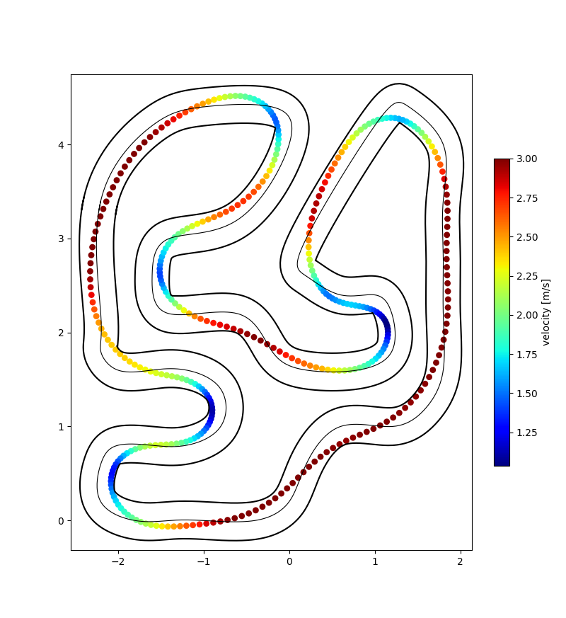

# Model Predictive Contouring Control

This repo contains an inprogress implementation of model predictive contouring control (MPCC) based on the ACADOS (kinematic model only) and forces PRO solver (both models).  A registered licence for forces PRO is required to run this part of the repo. 

## Problem formulation
[The mathematical formulation can be found here.](media/problem_formulation/problem_formulation.pdf) The resulting controller using the forces PRO solver with the dynamic model is shown below.


## ACADOS Setup

1. Clone this repo

2. Head to https://github.com/acados/acados and install acados following their instructions.
   Below is a brief summary.
 > clone acados and unpack
 ```shell
 git clone git@github.com:acados/acados.git
 cd acados
 git submodule update --recursive --init
 ```
 > then build it
 ```shell
 mkdir -p build
 cd build 
 cmake ..  
 make install
 ```
 > install dependencies
 ```shell
 pip3 install casadi
 ```
 >make python bindings:
```shell
 cd <acados_root>/build
 cmake -DACADOS_WITH_QPOASES=ON ..
 make install -j4
 pip3 install <acados_root>/interfaces/acados_template
 export LD_LIBRARY_PATH=$LD_LIBRARY_PATH:"<acados_root>/lib"
 export ACADOS_SOURCE_DIR=<acados_root>
 ```   
Note: I ended up putting the last two commands into my .bashrc
 >It should look something like this:
 ```shell
 export LD_LIBRARY_PATH=$LD_LIBRARY_PATH:"/home/pw/acados/lib/"
 export ACADOS_SOURCE_DIR=/home/pw/acados
 ```
>Test installation:
   ```shell
   cd <acados_root>/examples/acados_python/getting_started
   python3 minimal_example_closed_loop.py 
   ```
3.  All set up!
    Currently, I am working in mpcc/scripts/acados
    try running "$python3 python_sim.py kin" or "$python3 python_sim.py dyn" 
    
## Debug

Currently there are issues with the dynamic model. The solver is reporting error code 3, which corresponds to the minimal step size in the QP solver being reached.

The system equations are described using CasADi in models.py (in the function dynamic_model()). The solver is set up in acados_settings.py (in the function acados_settings_dyn())
